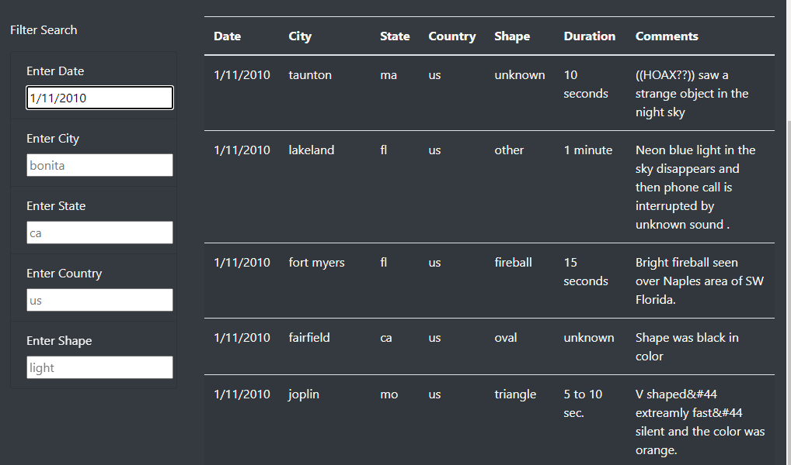

# UFOs

## Overview

The purpose of this analysis was to create a dynamic table that was both visually pleasing as well as functional. I took UFO sighting information from a data array with more than 1000 lines of code. The table would accept input from users and then filter the data and return the filtered answerset.

## Filtering the data

With the new javascript created to enhance the filter process, everything works as designed. The following options were selected as filters: 
* Date
* City
* State
* Country
* Shape

### Filter by Date
The first filter option is by date. I created a placeholder in the box that reads "1/10/2010" so the user knows what format we are looking for. 

All of the UFO sighting data from the date we filtered has been returned.

### Filter by City
The next filter users can search by is city. "bonita" was added as a placeholder so users know how we need the city typed in. 

### Filter by State
Adding a "State" filter helps broaden the information compared to how narrow the city filter was. 

### Filter by Country
The Country filter was also created to get a geographical idea of the types of sightings per region. "us" was used as a place holder. 

### Filter by Shape
Finally, a filter by shape of UFO was created. There are many different types of sightings out there and many believe that the shape can determine if its the same UFO visiting the same region. A placeholder of "light" was added to this filter.

## Results

In summary, the new active dynamic table works perfectly, and will filter any data based on those 5 criteria. Using the filters help easily navigate through the 1000+ lines of data that is connected to this table. 

One drawback that I found while using the filters, is that the only way to reset your filters is to either refresh the page or click on the navbar at the top of the page. The process can be daunting if you are trying to review multiple things on the site. A clear filter button at the bottom of the filters section would make this page exponentially better. Another idea that would make this better would be to use an API from a UFO website. This would keep the data updated rather than static. 